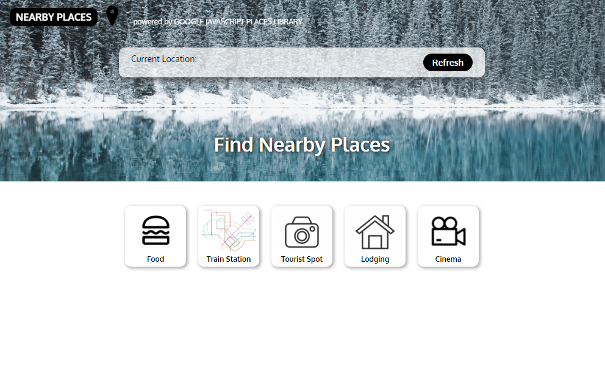

# Nearby Places
Nearby Places is a web app that allows a user to find nearby places based on his/her location. Created as one of the projects for SEI-33, GA. This is an attempt at using the JavaScript Library, React.js to implement a web application.  

## Stack
1. JavaScript
2. React.js
3. JSX

## Additional React.js packages
1. react-loader-spinner

## Setup
1. API keys are removed due to them being chargeable
2. `npm i` in the same directory as the json.package file.
3. `npm start` to run the app

## Consuming APIs
1. Google Maps Javascript API - Places Library
2. TomTom Maps RESTful API
